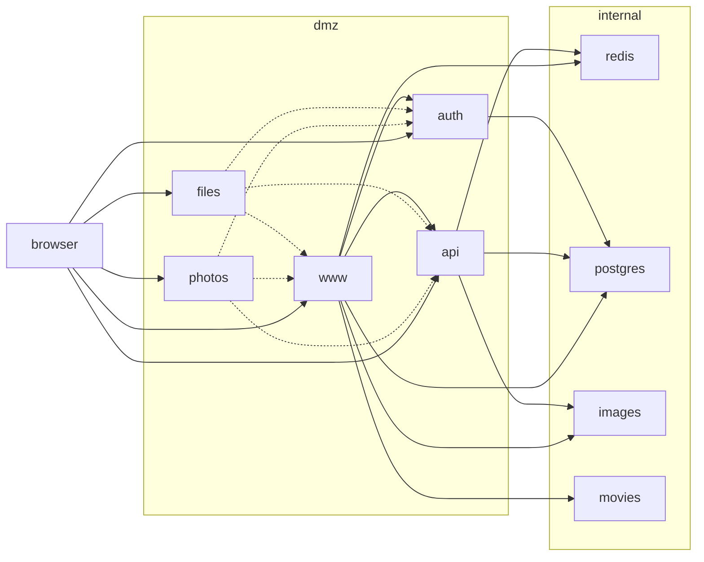

# mikeandwan.us environments

The goal of this document is to outline the environments for mikeandwan.us.
This covers everything from local development to production.  Given the
relatively low usage of these applications, and a desire to limit costs,
all components of the environment will be deployed on a single server.
Logically, these should be able to be fairly easily separated in the future
if desired, where the largest concern would likely be certificate management.

Development and deployment for this site has historically been built on Linux
workstations, primarily Fedora.  As such the information below assumes this as
a primary requirement for all environments (though production would only be the
Server flavor).  However, it is expected that most of the information below
could apply to other platforms, though some tools might need to be swapped out.
For example, podman is heavily used across the environments, but that may
need to be replaced with docker to achieve a similar architecture (or use WSL2
on Windows).

## dev

The dev environment is the primary environment used for development purposes.
The main purpose of this environment is to most efficiently edit and run the
application.  This translates to having tooling and runtimes installed on the
workstation, so the application can be easily edited and run with minimal fuss.

Requirements for the dev environment:

- hosts file entries will be made with dev. prefix (i.e. dev.www.mikeandwan.us)
- Relevant SDKs are installed / available
- Preferred editor and tools are installed and available
- Podman is installed and will be used to run supporting services in containers, like:
  - postgres
  - redis
  - solr
- podman will expose these services at default ports when possible
- podman will run these services as a systemd pod so they are easy to start/stop
- development applications will listen on non-standard ports
- applications will not be fronted by nginx
- environment variables will be set in .bash_profile which the app can use for configuration
- multimedia assets will be stored on directory somewhere on the workstation

Note: we use local prefix, as this is required when configuring things like Google OAuth

## test

The test environment is the primary environment to test container images and
can run side by side with the dev environment.

Requirements for the dev environment:

- hosts file entries will be made with test. prefix (i.e. test.www.mikeandwan.us)
- Container images are built using tooling from local environment and made
  available in the 'local' repository
- Container port mapping should be used to publish ports on the local machine
- environment variables will be stored in .env files for this environment
- a separate podman pod will be created to run the applications _and_ supporting services
- the same multimedia assets will be referenced via container volumes

## stage

If desired, a staging environment may be provisioned to additionally test the
deployment before reaching production.  This would occur on a separate machine
(like a virtual machine that is easily hosted on the local workstation, via Boxes).

## prod

The production environment is hosted on a separate server and will run all services
via podman containers and corresponding pod that is configured to start automatically.

Requirements for the prod environment:

- prod server hosts file to map prod fqdns to 127.0.0.1, so that internal requests
  resolve to the services in the pod (via 127.0.0.1)
- given that this is a secured environment not intended for individual use, configure
  sysctl to allow unpriviledged users to bind to low ports (>= 80) to avoid firewall
  redirect mappings
- router should be updated as follows:
  - DNS entries to be added for www,auth,api,files,photos (and their fqdn equivalents)
    and should point to the internal ip of the prod server (i.e. 192.168.1.x)
  - port forwarding rules should be added for 80 and 443 to point to the prod server's
    internal ip (192.168.1.x)

## todo

- Currently the gateway has special knowledge of dev vs prod as part of the containers.
  Consider env specific configuration to come in via volume or environment variables

## diagram

The following diagram attempts to illustrate key components and their relationships in
the deployment:

